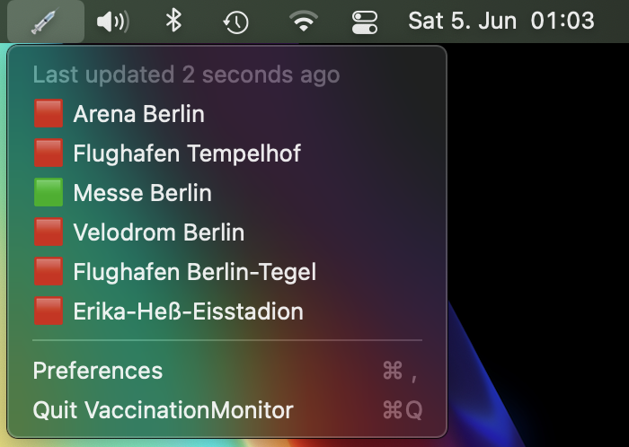

# VaccinationMonitor

If you live in Berlin you might know how difficult it is to find an appointment to get a COVID-19 vaccination.

This app notifies you as soon as new appointments open up in one of the vaccination centers.
Click on the notification or the vaccination center's name in the menu to directly open the website where you can book your appointment.

## Requirements

macOS Big Sur 11.0+

## Installation

- Download the [latest release from GitHub](https://github.com/DerLobi/VaccinationMonitor/releases/latest/download/VaccinationMonitor.zip)
- Open the app, it will now run in your menu bar
- Open the Preferences and enable notifications (not required, but highly recommended)

## Configuration

In Preferences you can change which vaccination centers are displayed in the menu bar and in notifications. By default, all centers are enabled.

## Acknowledgements

This app uses the API from [https://impfstoff.link](https://impfstoff.link) 

## License

(c) 2021 Christian Lobach [MIT License](https://github.com/DerLobi/VaccinationMonitor/blob/main/LICENSE)